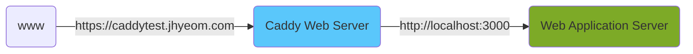
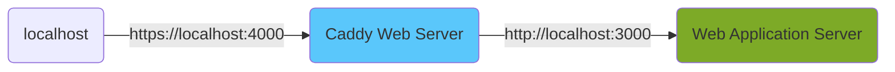

## Caddy Server

<div style="display: flex; align-items: center; justify-content: center; ">
  <div class="gh-card gh-medium" data-repo="caddyserver/caddy"></div>
</div>


Caddy 는 Golang 으로 작성된 웹 서버로, 자동으로 ssl 인증서를 발급 / 갱신하는 기능을 탑재하고 있다.


## 특징

- Caddyfile 이라는 자체 파일 형식을 사용하여 웹 서버의 동작 정의 (nginx 의 nginx.conf 파일처럼 자체 형식 사용)
- Let's Encrypt 를 사용하여 자동으로 ssl 인증서를 발급 / 갱신

## 활용 예시들

### 준비
- Caddy 설치: [설치 가이드](https://caddyserver.com/docs/install)
- VSCode 의 Caddyfile 용 확장 설치 (추천): [Caddyfile Syntax](https://marketplace.visualstudio.com/items?itemName=zamerick.vscode-caddyfile-syntax)
- 현재 접속중인 네트워크의 공인 IP 주소를 본인이 소유한 Domain 의 DNS Record (A/AAAA) 로 등록
- 현재 접속중인 네트워크가 라우터 아래에 구성된 사설망인 경우 DMZ 혹은 포트포워딩 설정

### public reverse proxy with ssl certificate

아래의 간단한 reverse proxy 인프라를 구성해 보자. 추가로 rotate 가 되는 access log 도 로그 디렉터리에 남겨보도록 한다.




- `Caddyfile` 생성. linux 에서 패키지 관리자를 통해 설치한 경우 `/etc/caddy/Caddyfile` 의 파일을 수정해도 된다.

```text
{
	email admin01@caddytest.jhyeom.com # 인증서 발급을 위해 적당한 이메일 주소를 넣어준다.
}

caddytest.jhyeom.com {
	reverse_proxy http://localhost:3000 {
		header_up X-Real-Ip {remote_host}
	}

	log {
		output file /var/log/caddy/caddy_access.log {
			roll_size 10
			roll_local_time
			roll_keep 20
		}
	}

	encode gzip
}
```

- caddy server 실행

```bash
$ caddy run --config Caddyfile

# 혹은, 백그라운드에서 실행
$ caddy start --config Caddyfile

# 혹은, linux systemd
# systemd service 는 직접 생성해 주어야 한다.
#   https://github.com/caddyserver/dist/blob/master/init/caddy.service 의 코드를
#   /etc/systemd/system/caddy.service 에 추가해 준 후 아래 명령어 실행
$ sudo systemctl start caddy
```

### private reverse proxy with mkcert

아래의 `localhost` reverse proxy 인프라를 구성해 보자. 개발 중 간혹 브라우저에서 https 를 요구하는 경우 [mkcert](https://github.com/FiloSottile/mkcert) 로 발행한 커스텀 CA 인증서로 localhost 도메인용 ssl certificate 를 발급받아 요긴하게 쓸 수 있다.



- mkcert 로 CA Certificate 를 로컬 머신에 설치 & localhost 도메인용 인증서 발급

```bash
$ mkcert -install
$ mkcert localhost
```

- `Caddyfile` 생성

```text
localhost:4000 {
	# mkcert 로 발행한 인증서 설정
	tls {$PWD}/localhost.pem {$PWD}/localhost-key.pem

	reverse_proxy http://localhost:3000

	encode gzip

	log {
		output stdout # log 는 stdout 에 찍는다
	}
}
```

- caddy server 실행

```bash
$ caddy run --config Caddyfile

# 혹은, 백그라운드에서 실행
$ caddy start --config Caddyfile
```

### SPA page file server

빌드한 SPA 페이지를 로컬에서 https 를 붙여 테스트해야 하는 경우 로컬에서 아래의 `Caddyfile` 을 사용. Static file 을 제공하는 CDN 처럼 동작한다.

```text
localhost:4000 {
	# mkcert 로 발행한 인증서 설정
	tls {$PWD}/localhost.pem {$PWD}/localhost-key.pem

	root * {$PWD}/build
	try_files {path} /index.html
	file_server

	encode gzip

	log {
		output stdout # log 는 stdout 에 찍는다
	}
}
```


## 유용한 링크

- [Caddyfile Directives](https://caddyserver.com/docs/caddyfile/directives)
- [Wildcard Certificate 를 위한 Route53 module](https://github.com/caddy-dns/route53)
  - Route53 모듈은 아직 비공식 모듈로, 이 기능을 사용하려면 위 모듈을 포함해 caddy binary 를 새로 빌드해야한다.


<script>
let cards = document.getElementsByClassName('gh-card');

function injectStyle(str) {
    let node = document.createElement('style');
    node.innerHTML = str;
    document.body.appendChild(node);
}

function injectStylesheet(url) {
  let node = document.createElement('link');
  node.setAttribute('rel', 'stylesheet');
  node.setAttribute('href', url);
  document.body.appendChild(node);
}

let style = `
.gh h4 {
  padding: 0;
  margin: 0;
}

.gh a, .gh a:visited {
  text-decoration: none;
  color: black;
}

.gh-small {
  zoom: 0.5;
}

.gh-medium {
  zoom: 0.75;
}

.gh-large {
  zoom: 1;
}
.gh-card {
    font-family: 'Arial';
    box-shadow: 0 4px 8px 0 rgba(0,0,0,0.2);
    transition: 0.3s;
    max-width: 300px;
    display: inline-block;
    text-align: center;
  margin: 8px;
  border-radius: 5px;
}

.gh-card:hover {
    box-shadow: 0 8px 16px 0 rgba(0,0,0,0.2);
}

img.gh {
  border-radius: 5px 5px 0 0;
  width: 100%;
clip-path: polygon(100% 0, 100% 95%, 50% 100%, 0% 95%, 0 0);
}

.container.gh {
  padding: 16px;
}

.gh p {
  line-height: 1.6;
  margin: 1em 0;
}
`;

injectStylesheet('https://maxcdn.bootstrapcdn.com/font-awesome/4.7.0/css/font-awesome.min.css');
injectStyle(style);

for(let card of cards) {
  let repo = card.getAttribute('data-repo');
  let url = 'https://api.github.com/repos/' + repo;

  fetch(url, {method: 'GET'}).then(resp => {
    return resp.json();
  }).then(json => {

    card.innerHTML = `
      
      <div class="gh container">
        <h4 class="gh">
          <a class="gh" href="${json.html_url}">
            ${json.full_name}
          </a>
        </h4>
        <p class="gh">${json.description}</p>
        <a class="gh" href="${json.html_url}/network">
          <i class="fa fa-fw fa-code-fork" aria-hidden="true"></i> ${json.forks_count}
        <a class="gh" href="${json.html_url}/stargazers">
          <i class="fa fa-fw fa-star" aria-hidden="true"></i> ${json.stargazers_count}
        </a>
      </div>
    `;

  }).catch(err => {
    console.log(err);
  });
}
</script>
